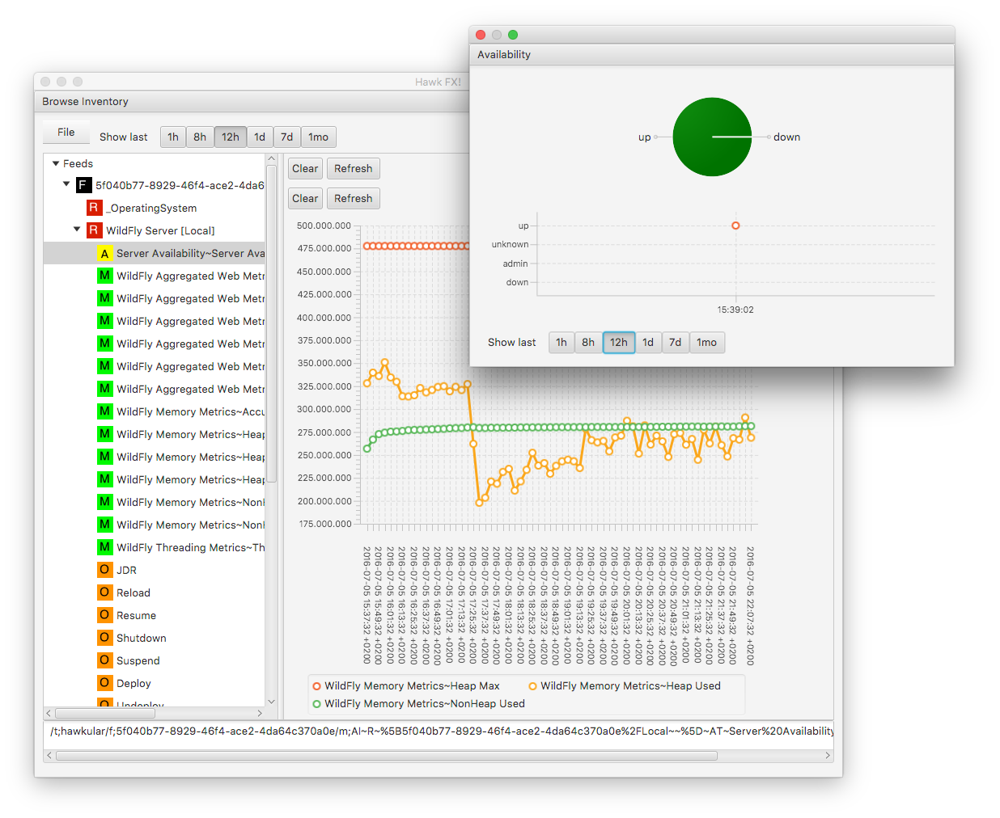

= Explorer for Hawkular

http://hawkular.org/[Hawkular] is a set of components for Monitoring.
This explorer connects to a Hawkular server and allows to browse trough
inventory and view entities, graph metrics.

ifndef::env-github[]

endif::[]
ifdef::env-github[]
image::https://github.com/pilhuhn/hawkfx/blob/master/docs/screenshot.png[]
endif::[]

== Running

The explorer requires JRuby in version 9+

If you are using `rvm` you can select it via

`rvm use jruby-9.0.5.0`

install and use `bundler` to install the required gems

`gem install bundler`

`bundle install`

then run

`jruby hawkfx.rb`