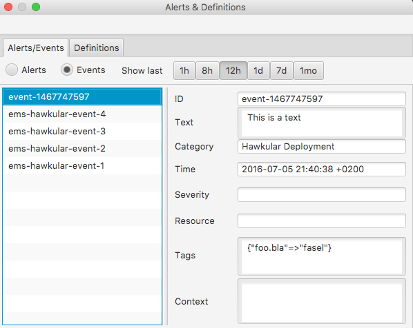

= Explorer for Hawkular

http://hawkular.org/[Hawkular] is a set of components for Monitoring.
This explorer connects to a Hawkular server and allows to browse trough
inventory and view entities, graph metrics.

.Main screen with availability pop-up
ifndef::env-github[]
image::docs/screenshot.png[]
endif::[]
ifdef::env-github[]
image::https://github.com/pilhuhn/hawkfx/blob/master/docs/screenshot.png[]
endif::[]

Other functions include listing of all metrics on a system, listing of Events/Alerts, injection of Events,
injection of metric values and a few more things.

.Events list
ifndef::env-github[]

endif::[]
ifdef::env-github[]
image::https://github.com/pilhuhn/hawkfx/blob/master/docs/event_list.png[]
endif::[]

== Running

The explorer requires JRuby in version 9+ and Java8

If you are using `rvm` you can select it via

`rvm use jruby-9.1.5.0`

NOTE:: You need a version of Java8 later than 8u45. Also JRuby 9.1.5 is required at the moment (later
versions have an issue that prevents JRubyFX from running correctly).

install and use `bundler` to install the required gems

`gem install bundler`

`bundle install`

then run

`jruby -G -S hawkfx.rb # faster than bundle exec jruby hawkfx.rb`

=== Using SSL

There is a blog post on the Hawkular
blog http://www.hawkular.org/blog/2016/09/14/consuming-hawkular-api-over-ssl.html[that describes how to use SSL] in Hawkular and HawkFX.

=== Assumptions

Please make sure your JDK version is newer than `8u45`, basically with the latest hostpot JDK from Oracle you should be fine.
